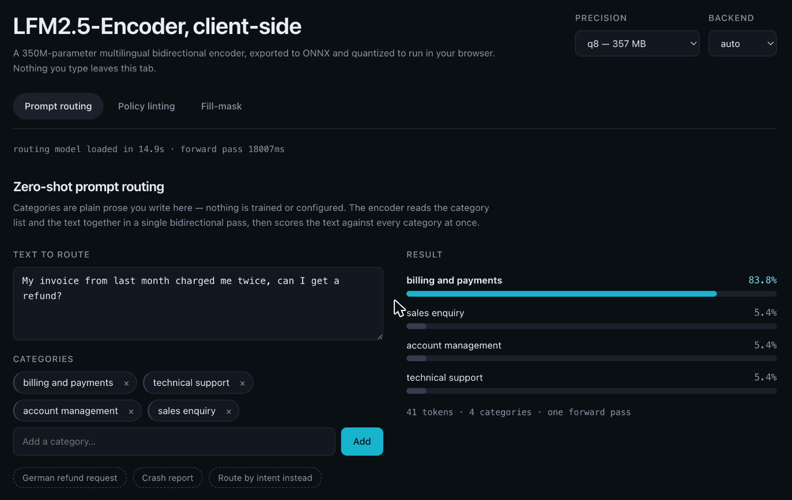
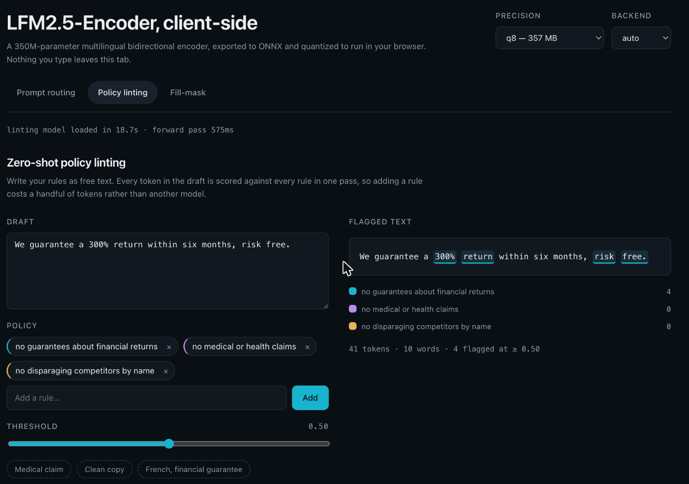
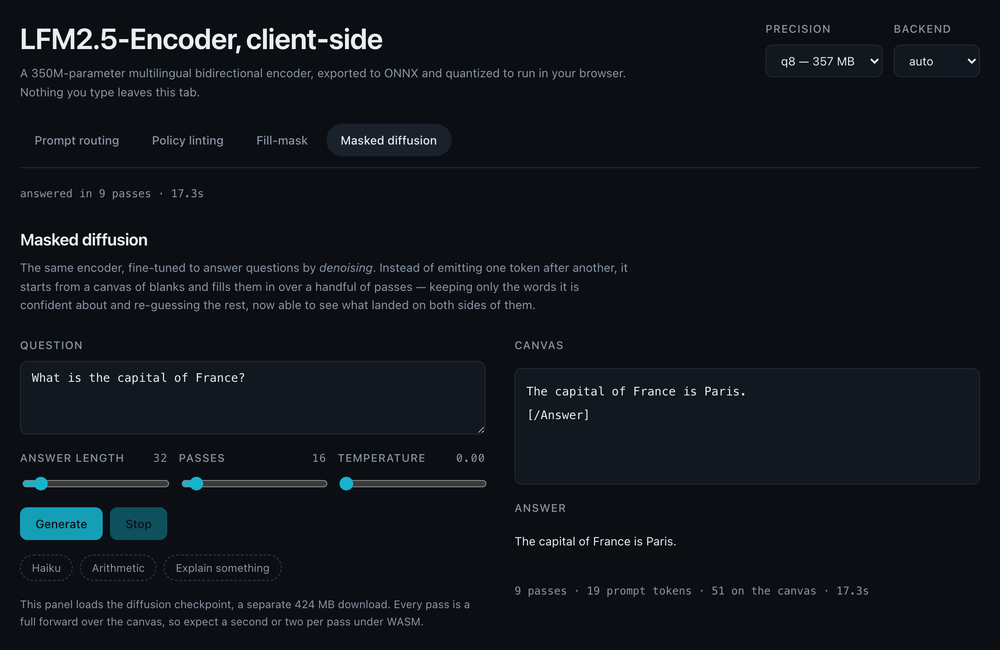
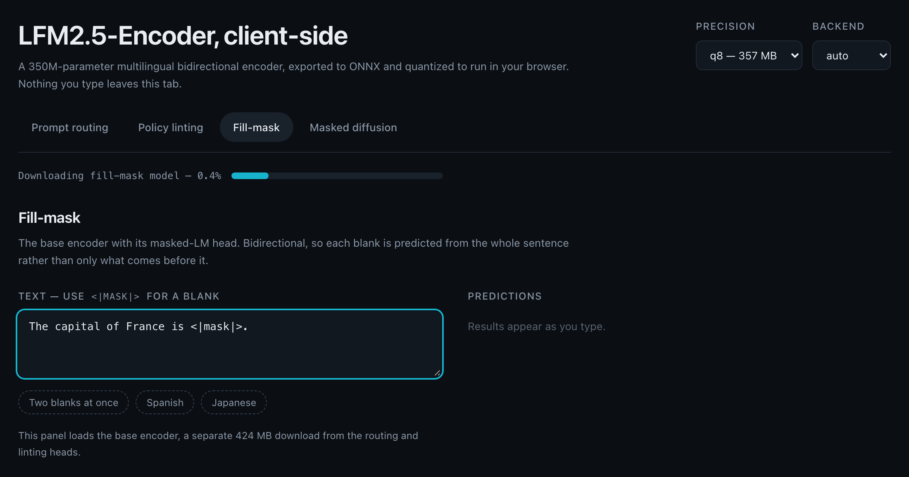

# lfm-encoder

[LFM2.5-Encoder-350M](https://huggingface.co/LiquidAI/LFM2.5-Encoder-350M) — Liquid AI's bidirectional
encoder — traced to ONNX, quantized, and run entirely client-side through
[transformers.js](https://github.com/huggingface/transformers.js). No inference server, no API key: the
weights are fetched once, cached by the browser, and every forward pass happens in the tab. Three of
Liquid's demos are reproduced here as worked examples — zero-shot
[prompt routing](https://huggingface.co/spaces/LiquidAI/prompt-routing) (score one text against free-text
categories), [policy linting](https://huggingface.co/spaces/LiquidAI/policy-linting) (score every word
against free-text rules) and
[masked diffusion](https://huggingface.co/spaces/LiquidAI/masked-diffusion) (generate text by denoising a
canvas of blanks instead of emitting a token stream) — plus fill-mask on the base encoder. The zero-shot
tasks take arbitrary labels supplied at call time; nothing is trained, fine-tuned or cached per label set.
Liquid's own diffusion space runs on a server CPU; this one runs in the tab.

## Live demo

**<https://kucukkanat.github.io/lfm-encoders/>** — runs entirely in your browser. The weights stream from
the Hugging Face Hub on first use and are cached afterwards; nothing you type leaves the tab.

Start on `q8` (357 MB). `fp32` is exact and faster once loaded, but it is a 1.4 GB download.

[](https://kucukkanat.github.io/lfm-encoders/)

Scoring free-text categories in one bidirectional pass — the categories are prose you type, nothing is
trained per label set.

[](https://kucukkanat.github.io/lfm-encoders/)

Every word scored against every rule, also in one pass. The threshold slider re-filters without
re-running the model.

[](https://kucukkanat.github.io/lfm-encoders/)

Generation as denoising: the answer starts as a canvas of `<|mask|>` tokens and condenses over a handful
of passes, each one keeping only what the model is confident about.

<details>
<summary>Fill-mask on the base encoder</summary>

[](https://kucukkanat.github.io/lfm-encoders/)

</details>

The deployed page is not cross-origin isolated (GitHub Pages cannot set COOP/COEP), so onnxruntime falls
back to single-threaded WASM there. Run it locally for the faster threaded build.

## Quickstart

```bash
bun install
bun run dev        # works immediately — weights stream from the Hub

# Optional: re-export from source instead of using the published weights. Needs the Python
# toolchain (see tools/export/README.md) and downloads ~4.3 GB of checkpoints from the Hub.
python3.12 -m venv .venv && source .venv/bin/activate
pip install torch "transformers>=5.12" onnx onnxruntime onnx_ir onnxconverter_common
bun run export

bun run dev   # http://localhost:5173
```

`bun run export` writes `models/` (~2.4 GB at the default dtypes) and takes tens of minutes, most of it
tracing fp32 graphs. It is resumable and skips repos that already exist.

Node-side, once `models/` is populated:

```ts
import { loadPromptRouter } from "@lfm-encoder/tasks";

const router = await loadPromptRouter({ modelRoot: "./models" });
const { top, scores, tokenCount } = await router.route(
	"My invoice from last month charged me twice, can I get a refund?",
	["billing and payments", "technical support", "account management", "sales enquiry"],
);

console.log(top); // { label: "billing and payments", score: 0.8377546809105774 }
console.log(tokenCount); // 41 — one pass covers the categories *and* the text
await router.dispose();
```

Omitting `modelRoot` fetches straight from the Hugging Face Hub — no export needed to try it:

```ts
const router = await loadPromptRouter();   // pulls kucukkanat/LFM2.5-Encoder-350M-Prompt-Router-ONNX
```

In the browser, `modelRoot` is a URL prefix instead of a path (`"/models"`). A local export is written to
`models/<owner>/<name>`, mirroring the Hub layout, so the same model id resolves either way.

## Published weights

| Hub repo | Task | q8 | q4 |
| --- | --- | --: | --: |
| [`kucukkanat/LFM2.5-Encoder-350M-ONNX`](https://huggingface.co/kucukkanat/LFM2.5-Encoder-350M-ONNX) | fill-mask / embeddings | 424 MB | 490 MB |
| [`kucukkanat/LFM2.5-Encoder-350M-Prompt-Router-ONNX`](https://huggingface.co/kucukkanat/LFM2.5-Encoder-350M-Prompt-Router-ONNX) | zero-shot routing | 357 MB | 448 MB |
| [`kucukkanat/LFM2.5-Encoder-350M-Policy-Linter-ONNX`](https://huggingface.co/kucukkanat/LFM2.5-Encoder-350M-Policy-Linter-ONNX) | zero-shot token matching | 357 MB | 448 MB |
| [`kucukkanat/LFM2.5-Encoder-350M-Diffusion-ONNX`](https://huggingface.co/kucukkanat/LFM2.5-Encoder-350M-Diffusion-ONNX) | masked diffusion | 424 MB | — |

`q4` is not published for the diffusion checkpoint: it fails the exporter's cosine-similarity gate against
fp32 (0.85 against a 0.90 threshold). A one-shot encoder absorbs that much drift; a decode loop that
conditions every pass on the last one does not.

Re-exports of Liquid AI's originals under the same
[LFM Open License v1.0](https://huggingface.co/LiquidAI/LFM2.5-Encoder-350M/blob/main/LICENSE); weights
are unchanged apart from quantization.

## Repo map

| Path | What |
| --- | --- |
| `packages/core` | Model loading, tokenization with character offsets, span pooling, prompt construction. [README](packages/core/README.md) |
| `packages/tasks` | The four task wrappers: prompt router, policy linter, fill-mask, masked diffusion. [README](packages/tasks/README.md) |
| `apps/demo` | Vite app. Serves `models/` off disk via a dev-server middleware so nothing is copied into a bundle. |
| `tools/export` | The Python exporter: Torch → ONNX → quantized ONNX, plus the parity harness. [README](tools/export/README.md) |
| `models/` | Export output. Gitignored — it is a build artifact measured in gigabytes. |

## Model sizes

Four repos come out of the exporter. All of them take `input_ids` + `attention_mask` and are dynamic in
batch and sequence.

| Repo | Outputs | Task |
| --- | --- | --- |
| `LFM2.5-Encoder-350M-ONNX` | `logits`, `last_hidden_state` | fill-mask / embeddings |
| `LFM2.5-Encoder-350M-Prompt-Router-ONNX` | `token_proj`, `rule_proj` | zero-shot routing (cosine head) |
| `LFM2.5-Encoder-350M-Policy-Linter-ONNX` | `token_proj`, `rule_proj` | zero-shot token matching (dot head) |
| `LFM2.5-Encoder-350M-Diffusion-ONNX` | `logits`, `last_hidden_state` | masked diffusion (no head; the loop is the task) |

| dtype | File | Base encoder | Router | Linter | Diffusion |
| --- | --- | --: | --: | --: | --: |
| `fp32` | `onnx/model.onnx` | 1687 MB | 1420 MB | 1420 MB | 1687 MB |
| `q8` | `onnx/model_quantized.onnx` | 424 MB | 357 MB | 357 MB | 424 MB |
| `q4` | `onnx/model_q4.onnx` | 490 MB | 448 MB | 448 MB | not shipped |

## Accuracy and speed

Accuracy is measured by `bun run parity`: the **JavaScript** runtime against the fp32 PyTorch reference,
over the fixtures frozen by `bun run export:check`. Δ is the largest absolute difference in a final
probability. This is deliberately not the Python-side number — Node and Python link different onnxruntime
builds with different kernels, and a browser's numbers have to be measured where a browser's runtime lives.

| Model | Metric | `fp32` | `q8` | `q4` |
| --- | --- | --: | --: | --: |
| Encoder (fill-mask) | max Δ | 9.6e-5 | 0.1846 | 0.2180 |
| | mean Δ | 4.1e-5 | 0.1235 | 0.0978 |
| | disagreements (top-5, 3 cases) | 0 | 4 | 3 |
| Prompt-Router | max Δ | 6.4e-5 | 0.0910 | 0.1221 |
| | mean Δ | 1.6e-5 | 0.0230 | 0.0309 |
| | disagreements (top-1, 4 cases) | 0 | 0 | 0 |
| Policy-Linter | max Δ | 8.4e-4 | 0.5241 | 0.3698 |
| | mean Δ | 3.4e-4 | 0.2328 | 0.1818 |
| | disagreements (threshold, 6 cases) | 0 | 3 | 3 |

Masked diffusion is measured differently, because per-logit error is the wrong question for a generative
loop: error that never moves an argmax is free, and error that does is compounded by every later pass
conditioning on the wrong token. So the same prompts are decoded greedily with each dtype and compared to
the fp32 PyTorch decode, token for token (3 prompts, 32-token canvas, 16 passes):

| Model | Metric | `fp32` | `q8` |
| --- | --- | --: | --: |
| Diffusion | differing generated tokens | 0 | 16 |
| | mean fraction of the answer | 0.000 | 0.167 |

`fp32` ONNX is **token-identical** to PyTorch, which is a stronger statement than any Δ in the table above
and the reason the decode loop can be trusted. `q8` paraphrases rather than degrades — it still answers the
question correctly — but it is not the same token stream.

Speed is measured by `bun run bench` — median router forward pass, onnxruntime CPU, M-series Mac:

| dtype | Cold load | 32 tokens | 183 tokens |
| --- | --: | --: | --: |
| `fp32` | 1.9 s | 100 ms | 274 ms |
| `q8` | 1.0 s | 150 ms | 439 ms |
| `q4` | 1.5 s | 86 ms | 242 ms |

**Quantization is optional here, and it is not a speed optimization.** A 350M-parameter encoder is small
enough that fp32 is entirely practical: it is exact, and it is *60% faster than `q8`*, because int8 weights
have to be unpacked before every matmul and that costs more than the memory bandwidth it saves.

Pick on the constraint that actually binds you:

- **Serving locally, or accuracy matters** — use `fp32`. Exact to ~1e-4, fastest bar `q4`. It costs 1.4 GB
  of disk and a slower cold load. This is the demo's default, since it serves weights off local disk.
- **Shipping over a network** — use `q8`. 4× smaller than fp32 and the smallest artifact here, since `q4`
  only rewrites `MatMul` nodes and the 65536×1024 embedding table is a `Gather`, so `q4` leaves 268 MB of
  it at fp32 while `q8` quantizes it too. The router never flips its top-1 at `q8`; the linter moves 3 of
  192 word/rule decisions across the 0.5 threshold.
- **Latency-bound on CPU** — use `q4`. Fastest of the three and comparable to `q8` on accuracy under
  Node's onnxruntime, at 66–91 MB more per repo. (Under *Python's* onnxruntime `q8` is clearly the more
  accurate of the two. Both were measured; neither result generalizes to the other runtime.)

### Browser memory

Measured as renderer-process RSS on macOS, one model in a freshly opened tab:

| Resident | File on disk | Renderer RSS | RSS / file |
| --- | --: | --: | --: |
| page only, no model | — | 134 MB | — |
| `q4` | 448 MB | 1354 MB | 3.0× |
| `fp32` | 1420 MB | 1449 MB | 1.0× |
| `q8` | 357 MB | 1762 MB | 4.9× |

**Quantization does not save memory here — `q8` costs more RAM than `fp32`.** onnxruntime's WASM kernels
work in float, so quantized weights are unpacked at session load: you pay full float residency *plus* the
packed copy. A model costs roughly 1.3–1.8 GB live regardless of how small its file is. This is the same
mechanism that makes `q8` slower than `fp32` above; the download is the only axis quantization wins on.

Two consequences worth designing around:

- **The WASM heap grows but does not shrink.** Disposing a model frees space for reuse *inside* the heap
  and returns nothing to the OS, so a tab's footprint is a high-water mark rather than a reflection of
  what is currently loaded. This is not an unbounded leak: cycling `q8`/`q4` 19 times in one tab peaked
  at 5.7 GB, then fell to 4.3 GB and stayed flat for the rest of a five-minute trace, every cycle
  succeeding. The space is reused; fragmentation just makes the mark higher than any single model. A
  page reload is the only full reclaim.
- **Budget ~1.5 GB per tab** for one model, and do not assume two can be resident at once. Holding several
  is what produced the `std::bad_alloc` the demo used to hit after three precision switches, which is why
  `apps/demo`'s worker keeps exactly one model resident.

### Browser backends

The constraints are different again, and one of them is hard:

- **`fp32` cannot be used with WebGPU.** A 1.4 GB session exceeds the allocation ceiling and dies with
  `std::bad_alloc`. It is fine on WASM. Leave `device` on `auto` unless you have a reason not to.
- **WebGPU + `q4` is the fastest browser path** — roughly 60 ms against ~160 ms for WASM on the same
  input, because `MatMulNBits` has a dedicated WebGPU kernel. Browser timings here are noisier than the
  table above, so treat them as a ranking, not a measurement; the demo prints its own per-pass timing in
  the status bar.
- **Only one model stays resident.** Sessions are 0.4–1.7 GB and onnxruntime will not survive several of
  them, so `apps/demo`'s worker disposes the previous model before loading the next. Re-selecting a
  precision costs a session rebuild, not a re-download.

`fp16` and `q4f16` are **not shipped**. `Lfm2RMSNorm` squares its input and sums over 1024 channels, which
overflows fp16's 65504 ceiling; `rsqrt(inf)` is 0 and every hidden state collapses to zeros. PyTorch avoids
this by upcasting to fp32 inside the norm, and `convert_float_to_float16` throws that protection away. The
symptom is nasty — the model loads, runs at full speed, and returns a uniform distribution for every input,
on WASM *and* WebGPU. `tools/export` can still emit them (`--dtypes q4f16`), but `verify()` now rejects a
collapsed graph by cosine similarity, so a broken artifact fails the build instead of shipping.

The `fp32` row is the honest floor of everything downstream of the graph: at ~1e-4 the TypeScript pooling,
the reconstructed character offsets and the traced graph agree with PyTorch to numerical noise. Any larger
drift at `fp32` is a bug, and the integration tests assert exactly that.

## How the zero-shot heads work

Both heads see one string, built by `buildPrefix`:

```
Categories:            Policy:
- billing              - no medical claims
- technical support    - no competitor names

Text:                  Text:
<the text>             <the draft>
```

That layout is what the models were trained on, and it is load-bearing — the character arithmetic that
finds each label depends on it byte for byte.

**One forward pass scores every label.** The prompt goes through the encoder once, bidirectionally, so
every text token attends to every label and every label attends to the text. Adding a category costs a few
more tokens, not another inference. The graph emits two per-token projections into a 256-d space:
`token_proj` (the query tower — the text) and `rule_proj` (the key tower — the labels).

Scoring then happens in JavaScript, and the two heads differ only in scalars recorded in `config.json`:

| | Prompt router | Policy linter |
| --- | --- | --- |
| Granularity | one score per label | one score per (word, rule) |
| Query vector | text region, mean-pooled, L2-normalized | each token's `token_proj`, unpooled |
| Key vector | label span, mean-pooled, L2-normalized | label span, mean-pooled |
| Score | cosine × learned temperature + bias | dot × 1/√256 + bias |
| Activation | softmax over labels (comparative, sums to 1) | sigmoid per pair (independent, absolute) |

**Why pooling can happen in JS at all.** The reference heads mean-pool hidden states and *then* project.
This graph projects every token and lets the caller mean-pool afterwards. That is exact, not an
approximation: both towers are affine, and an affine map commutes with a mean —

```
W @ mean(h_i) + b  ==  mean(W @ h_i + b)
```

— so the two orders produce the same vector. Reassociating it this way is what makes one static ONNX file
work for any label set: the graph never has to know how many rules there are, and no `(batch, rules, seq)`
pooling matrix has to be built and uploaded from JS on every call.

## How masked diffusion works

The diffusion checkpoint is architecturally *the same graph* as the base encoder — `input_ids` +
`attention_mask` in, `logits` out, no head, no cache. What makes it a chatbot is the loop wrapped around
it, which is implemented in TypeScript rather than baked into the ONNX file.

Generation starts from a **canvas**: the prompt, laid out in the template the diffusion-SFT run used,
followed by `maxNewTokens` copies of `<|mask|>`.

```
[Question]
What is the capital of France?
[/Question]

[Answer]
<|mask|><|mask|><|mask|> … <|mask|>
```

Each pass predicts every still-masked position at once and commits only a subset; the rest go back to
being masks and are predicted again next pass, now conditioned on what has just been written — to their
**right** as well as their left. That is the whole trick, and it is the one thing a causal decoder
structurally cannot do.

Which positions get committed is decided by three rules, all of which matter:

1. **Blocks.** Unmasking is confined to a `blockSize` window sweeping left to right. Without it the model
   commits scattered high-confidence tokens across the whole canvas — punctuation, stopwords, a closing
   `[/Answer]` — and then has to write prose around fixed points it chose before it had a sentence.
2. **Confidence.** Candidates within the block are ranked by softmax probability. Anything above `tau` is
   committed immediately; otherwise just enough are taken to keep the block inside its step budget. This
   is why `steps` is a budget rather than a count: an easy answer finishes in a quarter of it.
3. **Adjacency.** Two neighbouring positions are never committed in the same pass. Each was predicted
   while the other was still a mask, so both are individually likely and jointly often not — this rule is
   what stops "the the".

Vocabulary padding has to be handled explicitly: ids at or above `realVocabSize` (64402 of 65536) were
never trained, and they are excluded from the argmax *and* the softmax denominator.

Liquid's Space also caches K/V and shortconv state so later passes recompute only the active block. That
needs a graph with cache inputs and outputs; this export has neither, and re-runs the full canvas every
pass instead. Simpler, exact, and a constant `T / blockSize` factor more compute — which is affordable
precisely because passes are counted in tens rather than in tokens.

## Scripts

| Command | What |
| --- | --- |
| `bun run export` | Export all four repos into `models/`. |
| `bun run export:check` | Python-side parity report + writes the `fixtures.json` the TS tests replay. |
| `bun run parity` | JavaScript-side parity report — the table above. |
| `bun test` | Unit tests. No weights required. |
| `bun test:integration` | Integration tests against the real ONNX graphs; skipped if `models/` is absent. |
| `bun run build` | `tsc` build of both packages. |
| `bun run typecheck` | Full project typecheck. |
| `bun run check` | Biome lint + format. |
| `bun run dev` | The Vite demo. |

Integration tests and `parity` find the weights via `LFM_MODEL_ROOT`, defaulting to `./models`.

## Limitations

- **`models/` is a gitignored build artifact**, ~3.5 GB with the default dtypes and ~8 GB if you keep the
  fp32 graphs. Reproduce it with `bun run export`; never commit it.
- **`fp16` and `q4f16` are not shipped.** They collapse to zeros on WASM *and* WebGPU; see the
  accuracy section for why. Only `fp32`, `q8` and `q4` are built by default.
- **Browser download sizes are the real constraint.** The smallest CPU-viable pair (router + linter at
  `q8`) is 714 MB. There is no smaller LFM2.5 encoder to fall back to.
- **First load is slow** — the graph has to be fetched and the WASM session built. Subsequent loads hit the
  HTTP cache, and the demo serves weights with `Cache-Control: immutable` so they are never re-fetched.
  Nothing here streams or shards the weights.
- **Three of Liquid's five demos are implemented** (prompt routing, policy linting, masked diffusion),
  plus fill-mask on the base encoder. The rest are not.
- **Masked diffusion is slow in the browser.** Every pass is a full forward over the canvas and a default
  run is 32 of them, so expect tens of seconds under WASM where the other tasks take one pass. The demo's
  panel is the only one that does not run on its own — you have to press Generate.
- **`q4` is not published for the diffusion checkpoint.** It fails the exporter's cosine-similarity gate
  against fp32; a loop that conditions each pass on the last does not tolerate the drift a one-shot
  encoder absorbs.
- **Batch is 1 everywhere in the JS path.** The graph is traced with a dynamic batch axis and handles
  padding correctly, but `EncoderModel.forward` feeds a single sequence and drops the batch axis.
- **The exporter needs a Python toolchain that is not vendored** — no lockfile, no pinned environment. See
  `tools/export/README.md` for what was actually used.

## License

MIT. The model weights are Liquid AI's and carry their own license; see the model card.
